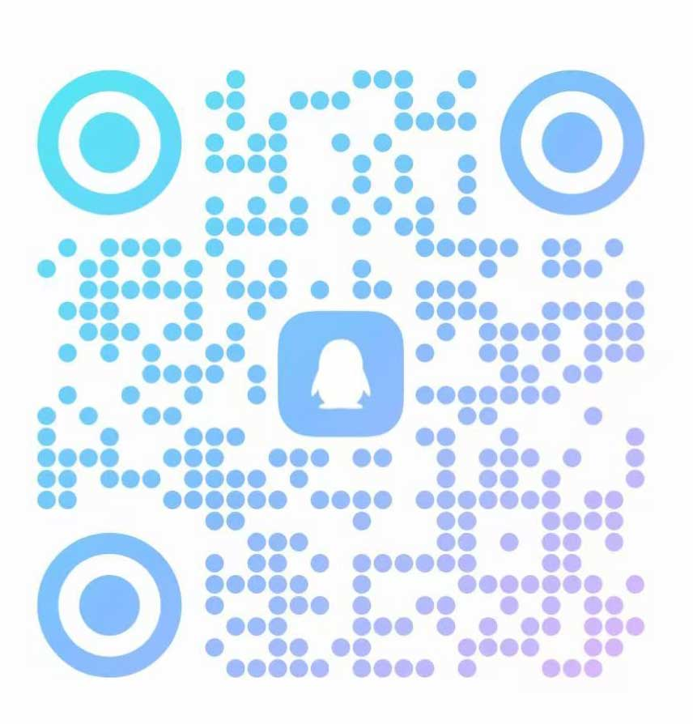

# FFBrowser 飞鱼智能指纹浏览器 - 智能控制台

[English](./README_EN.md) | [中文](./README.md)

**飞鱼智能指纹浏览器 (FFBrowser)** 是一款专为隐私保护和自动化设计的专业级浏览器平台。本仓库是 FFBrowser 的**智能控制台**（Intelligent Console）和**自动化生态系统**的官方主页，提供 SDK、API 文档和开发者工具。

官网: [https://www.ffbrowser.xyz](https://www.ffbrowser.xyz)

## 🌟 核心功能

飞鱼浏览器不仅是一个防关联工具，更是一个强大的自动化基础设施。

### 🛡️ 硬件级防指纹 & 隐私保护
- **深度模拟**: 修改操作系统及硬件环境特征，配合种子值扰动，实现真实的硬件级防关联。
- **通过主流检测**: 完美通过 BrowserScan, Iphey, PixelScan，等主流指纹检测平台。
- **本地数据存储**: 所有数据保存在本地，不同步云端，彻底保护用户数据安全。

### 💻 多平台 & 多品牌支持
- **多系统模拟**: 支持在windows上模拟 Windows 10/11, macOS 12-15, Android 10-14。
- **多浏览器内核**: 自定义浏览器品牌（Edge, Chrome, Brave 等）及版本号。

### 🤖 智能控制台 & 自动化 (本仓库核心)
- **本地 API/SDK**: 提供强大的本地 HTTP API，支持二次开发。
- **无限调用**: 不限调用频率，不限窗口数量。
- **自动化集成**: 易于集成 Selenium, Puppeteer, Playwright 等自动化框架。
- **AI Agent Ready**: 专为 AI Agent 设计的确定性执行环境。

## 🚀 架构概览

```text
+--------------------------+
|     自动化层 / AI Agent   |
|   (SDKs / Python / JS)   |
+------------+-------------+
             |
             | 本地 HTTP API
             |
+------------v-------------+
|    飞鱼浏览器内核 (Core)   |
|   (硬件级指纹模拟引擎)     |
+--------------------------+
```

- **飞鱼浏览器内核**: 作为本地后台服务运行。
- **本地 HTTP API**: 自动化工具通过 API 控制浏览器环境。
- **SDKs**: 封装 API 调用，提供开发者友好的接口。

## 🛠️ 快速开始

1. **下载并安装飞鱼浏览器**: [前往官网下载](https://www.ffbrowser.xyz) (支持 Windows 7+ x64)。
2. **启动服务**: 运行飞鱼浏览器，确保本地服务已启动。
3. **调用 API**: 使用提供的 SDK 或直接调用本地 API 接口控制浏览器。

## 📚 文档与资源

- **API 文档**: 请下载并启动 **飞鱼浏览器客户端**，在软件内部查看完整的本地 API 接口说明。

## 💰 订阅价格

飞鱼浏览器采用灵活的订阅模式：
- **月付**: 30 元 / 30 天
- **年付**: 300 元 / 365 天 (优惠 18%)
- **包含**: 无限窗口数量、无限 API 调用、无限导入导出。
- **试用**: 新用户免费试用 3 天。

## 📞 联系我们

- **官网**: https://www.ffbrowser.xyz
- **邮箱**: mp7788414@outlook.com
- **GitHub**: 提交 Issue 或 PR 参与贡献。
- **QQ 交流群**: 群号：574418234(飞鱼智能指纹浏览器交流)，或扫码加入

  

---
*注：飞鱼浏览器内核为商业软件，本仓库提供的 SDK 和工具为开源项目。*
